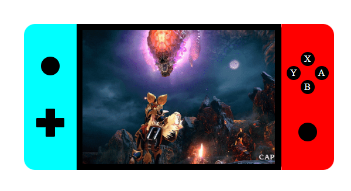

<h3 align="center">Consola Switch</h3>

[Ver el proyecto](https://kanandee.github.io/consola/)

## 💭 Como lo he hecho 
He utilizado html y css para poder recrear la Nintendo switch. He añadido un gif de mi juego favorito para darle más vida al proyecto.
Adjunto link para poder ver la consola y también foto de como ha quedado.

